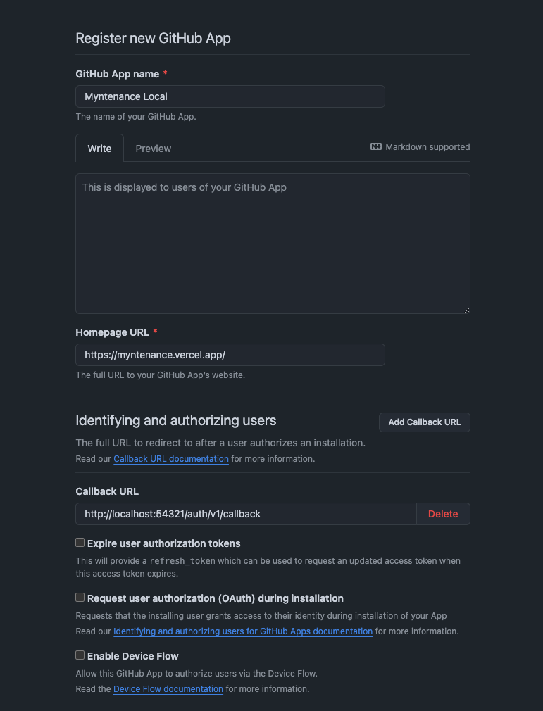
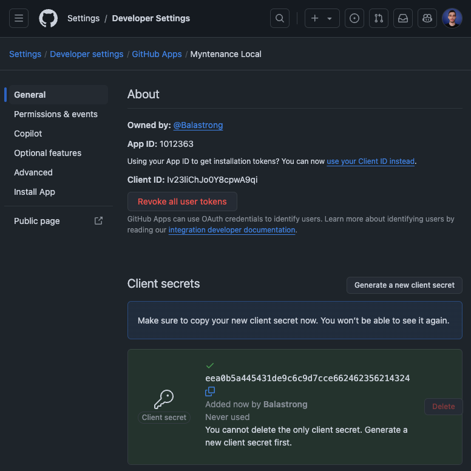
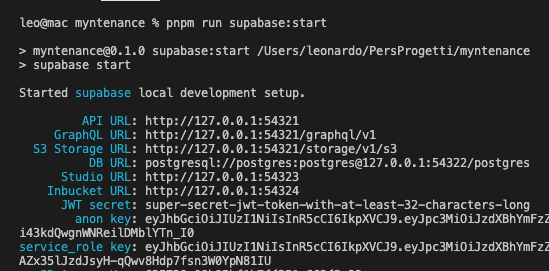

# How to Contribute

Myntenance is a welcoming project and we're really happy to build it together.

You can find in this document the steps to run the project locally and get ready to contribute.

Something is wrong or missing? Feel free to open an issue or a pull request.

## Setup the local environment

Duplicate the file `.env.example` and rename it to `.env.local` to set up the environment variables.

Let's see how to enable login through GitHub OAuth App and setup a local supabase instance.

### Setup GitHub App (Authentication)

In order to enable login through GitHub you need to create a GitHub App. You can get from there the two keys needed to enable the authentication.

You can learn more on the [official GitHub documentation](https://docs.github.com/en/apps/creating-github-apps/registering-a-github-app/registering-a-github-app) or follow the steps below:

1. On GitHub go to `Settings` -> `Developer Settings` -> `GitHub Apps` and click the `New GitHub App` button.
1. Fill in the values as shown in the image below.

   - Make sure `http://localhost:54321/auth/v1/callback` is set as the `Callback URL` as this will be your local supabase URL.
   - You can also disable `Expire user authorization tokens` for development purposes.

   

1. Disable `Webhook` (make sure `Active` is unchecked)

1. Setup Repository permissions (scroll down in the same page)

   - Set `Read-only` for: Actions, Contents, Metadata, Pull requests
   - Set `Read & Write` for: Issues

1. Setup User permissions (scroll down in the same page)

   - Set `Read-only` for: Email addresses

1. Optional: You can keep `Where can this GitHub App be installed?` as `Only on this account` for development purposes.

1. Click on `Create GitHub App` button.

1. Click on `Generate a new client secret`.

1. Copy the `Client ID` and `Client Secret` and paste them in the `.env.local` file, respectively into the `REACT_APP_GITHUB_CLIENT_ID` and `REACT_APP_GITHUB_CLIENT_SECRET` variables.

   

### Setup Supabase (Database)

During development you will use a[ local Supabase instance](https://supabase.com/docs/guides/cli/local-development#start-supabase-services). Make sure to have [Docker](https://www.docker.com/) installed on your machine and running.

1. Run `pnpm run supabase:start` to start the database container (the first time it will take a while to download the image).
1. Copy the following values into your `.env.local` file:
   - `NEXT_PUBLIC_SUPABASE_URL` -> From `API URL` (default: `http://localhost:54321`)
   - `NEXT_PUBLIC_SUPABASE_ANON_KEY` -> From `anon key`
   - `SUPABASE_SERVICE_KEY` -> From `service key`
     

## Git Workflow

1. Fork the repository
2. Clone the repository to your local machine
3. Create a new branch

```
 git checkout -b <branch-name>
```

4. Make your changes
5. Commit and push your changes

```
 git add .
 git commit -m "commit message"
 git push origin <branch-name>
```

6. Create a pull request
7. Wait for the pull request to be reviewed and merged
